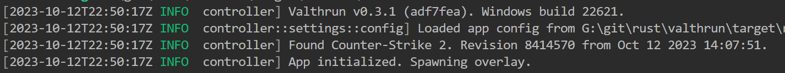

---
title: CS2 游戏内覆盖
---

# Valthrun CS2 覆盖层

## 功能

Valthrun 覆盖层是在运行中的 Counter Strike 2 应用程序上的游戏内覆盖，包含以下功能：

- 外部雷达  
  在 https://radar.valth.run 上发布你的游戏状态。  
  更多信息请参见[此处](./cs2_radar_standalone)。

- 玩家 ESP  
  提供多种配置选项的 ESP，比如：骨架显示、3D 盒子和 2D 盒子

  - 可配置颜色来区分敌人和队友
  - ESP 包含玩家血量、血条、武器等信息

- 炸弹信息

  - 炸弹爆炸的倒计时
  - 拆弹信息，如拆弹计时器
  - 炸弹所在的炸弹点位置

- 自动射击  
  敌人（或队友）一进入准心即自动射击

- 观察者信息  
  显示当前观战你的玩家列表 / 观察目标

- 默认屏蔽直播  
  Valthrun 覆盖层不会显示在任何屏幕分享中

要访问 Valthrun 的设置覆盖，按下 `PAUSE` 键。

## 前置要求

在使用 CS2 游戏内覆盖之前，您需要获取以下前置条件：

1. 下载 CS2 游戏内覆盖（controller.exe）  
   从 GitHub 下载最新的 CS2 游戏内覆盖：  
   https://github.com/Valthrun/Valthrun/releases/tag/latest

2. 设置 Valthrun 驱动  
   如何设置 Valthrun 驱动的详细步骤请参考[驱动部分](../driver/)。  
   CS2 游戏内覆盖需要成功加载一个 Valthrun 驱动程序。

## 设置

一旦成功加载了 Valthrun 驱动，并且 CS2 已经启动运行，  
您可以通过运行 `controller.exe` 启动 Valthrun 覆盖层。  
如果一切设置正确，您应当会看到如下所示的终端窗口：  

完成这些步骤后，您现在可以使用 Valthrun，并利用其对 Counter-Strike 2 的游戏增强功能。  
您可以通过按下 `PAUSE` 键访问覆盖。如果您的键盘上没有此键，请参考[在没有 PAUSE 键的情况下打开 GUI](../../troubleshooting/overlay/pause_key)。

## 与 Faceit 一起使用

可以使用 Valthrun CS2 游戏内覆盖配合 Zenith 驱动在 Faceit 上使用，但并不推荐。  
在 Faceit 上玩 Counter Strike 2 时使用该覆盖层可能会导致您的帐户被标记，因为可能违反了 Faceit 的政策。

未来可能会开发一种解决方案，以便在不实际覆盖游戏的情况下保留覆盖层的所有功能，从而允许用户在不冒被检测风险的情况下享受这些功能。

## 展示

import Showcase from "@site/src/components/showcase";

<Showcase />
